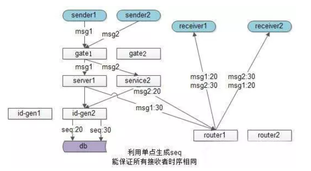

---


---

# 4：消息id设计


分布式环境下, 即时消息的时序难以保证.

## 1.几种场景.

#### 1.1分布式环境


​	多发送方不能保证时序, 假设只有一个发送方, 由于多个接收方的存在, 无法保证发送方的本地时间, 因此无法保证绝对时序.

​	web1先后发送msg1, 然后发送msg2, 由于网络传输以及多接受方存在, 无法保证msg1先被接收方处理, 故无法保证msg1和msg2的处理时序.

#### 1.2网络传输和多线程


​	多发送方和多接收方难以保证绝对时序, 假设只有单一的发送方和单一接收方, 但是由于网络传输和多线程存在, 仍不能保证绝对的时序.

​	web1先后发送msg1和msg2, 及时msg1先到达(网络传输其实不能保证msg1先到达), 但是由于多线程存在, 也不能保证msg1先被处理完.

## 2.生产环境思考

​	其实大部分业务能够接受误差不大的趋势递增id.

​	消息发送, 帖子发布时间, 秒杀时间没有那么精准的时序要求.

​	同1s发布聊天消息乱序了.

​	同1s发布的帖子排序不对.

​	同1s发起的秒杀, 由于服务器多台之间时间有误差, 落到A服务器秒杀成功, 落到B服务器的秒杀还没开始, 业务上可以接受(用户感知不到).

​	所以大部分业务, 长时间趋势递增的时序能够满足业务需求, 非常短时间时序误差一定程度可以接受.

#### 2.1 IM单聊中, 如何保证发送顺序和接受顺序

​	IM中单人聊天需求, 发送A依次发送msg1, msg2, msg3给接收方B, 三条消息能否保证时序的一致性(发送和显示的顺序一致)

​	如何利用利用服务器单点序列化时序, 可能会出现服务端接受消息的时序为msg3, msg1, msg2, 与发出序列不一致.

​	业务上不需要全局消息一致, 只需要对同一发送A, 给B的消息时序一致就行, 常见优化方案, 在A向B发送消息中, 加上发送方的一个绝对时序, 表示接收方B的展现时序.

​	

如果接收方B先收到msg3, msg3会先展现, 后收到msg1和msg2后, 会展现在msg3的前面.

#### 2.2IM群聊消息, 如何保证接收方顺序一致.

IM群消息需求, N个群友在一个群, 如何保证所有人收到消息展示时序一致?

此时不能利用发送方的seq保证时序, 因为发送方不单点, 时间不一致.

可以利用服务器单点.



send1发出msg1, send2发出msg2.

sercice底层可以拿到一个唯一seq, 确定接收方展现时序.

service拿到msg2的seq是20, msg1的seq是30.

通过投递服务将消息给多个群友, 群友即使接受msg1和msg2时间不同, 但是可以统一按照seq展现.

这个方式能实现所有群友消息展示时序相同, 缺点是这个生成的全局递增序列号服务容易成为系统瓶颈.

优化 : 群消息其实不用保证全局消息有序, 只要保证一个群内的消息有序即可, 这样id串行化成了一个很好思路.

​	这个方案中service层不需去一个统一的后端拿全局seq, 而是service连接池做了细小改造, 保证一个群内消息落在同一个service上, 这个service可以用本地seq序列化同一个群所有消息, 保证所有群友消息时序是相同.

## 3.参考.

<https://www.jianshu.com/p/386b550775fb>

## 4.总结

分布式环境下, 消息的有序性很难保证, 比如时钟不一致, 多发送方, 多接受方, 多线程和网络传输的不确定性.

但是对于IM聊天来说, 消息id可以容忍非常短时间内的时间误差. 只要能保证趋势递增即可.

所以在我的IM系统中, 采用facebook的snowflake来实现消息id的生成. snowflake也是趋势递增的. 可以满足当前场景.

## 5.消息id生成架构


原谅我用的画图工具, 实在找不到不错的灵活自如的画图工具.

下面是snowflake生成的id的数据格式:

```java
0 - 0000000000 0000000000 0000000000 0000000000 0 - 00000 - 00000 - 000000000000
```

- 1位标识，由于long基本类型在Java中是带符号的，最高位是符号位，正数是0，负数是1，所以id一般是正数，最高位是0
- 41位时间戳(毫秒级)，注意，41位时间戳不是存储当前时间的时间戳，而是存储时间戳的差值（当前时间戳 -开始时间戳)得到的值），这里的的开始时间戳，一般是我们的id生成器开始使用的时间，由我们程序来指定的（如下下面程序epoch属性）。41位的时间戳，可以使用69年.
- 10位的数据机器位，可以部署在1024个节点，包括5位datacenterId和5位workerId.
- 12位序列，毫秒内的计数，12位的计数顺序号支持每个节点每毫秒(同一机器，同一时间戳)产生4096个ID序号加起来刚好64位，为一个Long型。

这里我们使用zookeeper来管理数据机器码, 便于扩展, 不用每个服务维护不同的机器码.

定义zookeeper管理机器位路径: /slim/worker_id/{workerId}

使用临时节点.

1. service启动时候, snowflake模块连接zookeeper.
2. 获取父节点/slim/worker_id下所有子节点的name.
3. 当前机器从0~1023个workerId开始遍历, 查找未被注册的workerId ( childNodeName.contain(workerId) ).
4. 当遍历到workerId=10, 发现此workerId未被其他机器注册. 即向zk注册临时节点/slim/worker_id/10.
5. 当遍历中发现workerId已经被注册, 则遍历下一个.

## 6.snowflake算法

很有必要看看如何实现趋势递增的算法.

```java
package com.imadcn.framework.idworker.algorithm;

import org.slf4j.Logger;
import org.slf4j.LoggerFactory;

/**
 * Snowflake的结构如下(每部分用-分开): <br>
 * 0 - 0000000000 0000000000 0000000000 0000000000 0 - 00000 - 00000 - 000000000000 <br>
 * <b> · </b>1位标识，由于long基本类型在Java中是带符号的，最高位是符号位，正数是0，负数是1，所以id一般是正数，最高位是0 <br>
 * <b> · </b>41位时间戳(毫秒级)，注意，41位时间戳不是存储当前时间的时间戳，而是存储时间戳的差值（当前时间戳 -
 * 开始时间戳)得到的值），这里的的开始时间戳，一般是我们的id生成器开始使用的时间，由我们程序来指定的（如下下面程序epoch属性）。41位的时间戳，可以使用69年
 * <br>
 * <b> · </b>10位的数据机器位，可以部署在1024个节点，包括5位datacenterId和5位workerId <br>
 * <b> · </b>12位序列，毫秒内的计数，12位的计数顺序号支持每个节点每毫秒(同一机器，同一时间戳)产生4096个ID序号
 * 加起来刚好64位，为一个Long型。
 * <p>
 * SnowFlake的优点是，整体上按照时间自增排序，并且整个分布式系统内不会产生ID碰撞(由数据中心ID和机器ID作区分)，并且效率较高，经测试，SnowFlake每秒能够产生26万ID左右。
 * <p>
 * 注意这里进行了小改动: <br>
 * <b> · </b>Snowflake是5位的datacenter加5位的机器id; 这里变成使用10位的机器id (b) <br>
 * <b> · </b>对系统时间的依赖性非常强，需关闭ntp的时间同步功能。当检测到ntp时间调整后，将会拒绝分配id
 * 
 * @author yangchao
 * @since 1.0.0
 */
public class Snowflake {

   private static final Logger logger = LoggerFactory.getLogger(Snowflake.class);

   /**
    * 机器ID
    */
   private final long workerId;
   /**
    * 时间起始标记点，作为基准，一般取系统的最近时间，默认2017-01-01
    */
   private final long epoch = 1483200000000L;
   /**
    * 机器id所占的位数（源设计为5位，这里取消dataCenterId，采用10位，既1024台）
    */
   private final long workerIdBits = 10L;
   /**
    * 机器ID最大值: 1023 (从0开始)
    */
   private final long maxWorkerId = -1L ^ -1L << this.workerIdBits;
   /**
    * 机器ID向左移12位
    */
   private final long workerIdShift = this.sequenceBits;
   /**
    * 时间戳向左移22位(5+5+12)
    */
   private final long timestampLeftShift = this.sequenceBits + this.workerIdBits;
   /**
    * 序列在id中占的位数
    */
   private final long sequenceBits = 12L;
   /**
    * 生成序列的掩码，这里为4095 (0b111111111111=0xfff=4095)，12位
    */
   private final long sequenceMask = -1L ^ -1L << this.sequenceBits;
   /**
    * 并发控制，毫秒内序列(0~4095)
    */
   private long sequence = 0L;
   /**
    * 上次生成ID的时间戳
    */
   private long lastTimestamp = -1L;

   private final int HUNDRED_K = 100_000;

   /**
    * 低并发模式
    */
   private boolean lowConcurrency = false;

   /**
    * @param workerId
    *            机器Id
    */
   private Snowflake(long workerId, boolean lowConcurrency) {
      if (workerId > this.maxWorkerId || workerId < 0) {
         String message = String.format("worker Id can't be greater than %d or less than 0", this.maxWorkerId);
         throw new IllegalArgumentException(message);
      }
      this.workerId = workerId;
      this.lowConcurrency = lowConcurrency;
   }

   /**
    * Snowflake Builder
    * 
    * @param workerId
    *            workerId
    * @return Snowflake Instance
    */
   public static Snowflake create(long workerId) {
      return create(workerId, false);
   }

   /**
    * Snowflake Builder
    * 
    * @param workerId
    *            workerId
    * @return Snowflake Instance
    */
   public static Snowflake create(long workerId, boolean lowConcurrency) {
      return new Snowflake(workerId, lowConcurrency);
   }

   /**
    * 批量获取ID
    * 
    * @param size
    *            获取大小，最多10万个
    * @return SnowflakeId
    */
   public long[] nextId(int size) {
      if (size <= 0 || size > HUNDRED_K) {
         String message = String.format("Size can't be greater than %d or less than 0", HUNDRED_K);
         throw new IllegalArgumentException(message);
      }
      long[] ids = new long[size];
      for (int i = 0; i < size; i++) {
         ids[i] = nextId();
      }
      return ids;
   }

   /**
    * 获得ID
    * @return SnowflakeId
    */
   public synchronized long nextId() {
      return lowConcurrency ? nextIdOnLowConcurrency() : nextIdOnHighConcurrency();
   }
   
   /**
    * 高并发模式
    * <p> 官方标准算法
    * @return SnowflakeId
    * @since 1.2.5
    */
   private long nextIdOnHighConcurrency() {
      long timestamp = timeGen();
      // 如果上一个timestamp与新产生的相等，则sequence加一(0-4095循环);
      if (this.lastTimestamp == timestamp) {
         // 对新的timestamp，sequence从0开始
         this.sequence = this.sequence + 1 & this.sequenceMask;
         // 毫秒内序列溢出
         if (this.sequence == 0) {
            // 阻塞到下一个毫秒,获得新的时间戳
            timestamp = this.tilNextMillis(this.lastTimestamp);
         }
      } else {
         // 时间戳改变，毫秒内序列重置
         this.sequence = 0;
      }
      // 如果当前时间小于上一次ID生成的时间戳，说明系统时钟回退过这个时候应当抛出异常
      if (timestamp < this.lastTimestamp) {
         String message = String.format("Clock moved backwards. Refusing to generate id for %d milliseconds.", (this.lastTimestamp - timestamp));
         logger.error(message);
         throw new RuntimeException(message);
      }
      this.lastTimestamp = timestamp;
      // 移位并通过或运算拼到一起组成64位的ID
      return timestamp - this.epoch << this.timestampLeftShift | this.workerId << this.workerIdShift | this.sequence;
   }

   /**
    * 低并发模式
    * <p>雪花算法默认实现在调用频次低的情况下，都是垮毫秒生成，导致sequence全是0，最终数据都是偶数，奇偶不平均。此模式下sequence全局自增，同ms内溢出后，等待下1ms，而不是每次都置零。
    * @return SnowflakeId
    * @since 1.2.5
    */
   private long nextIdOnLowConcurrency() {
      long timestamp = timeGen();
      // 如果当前时间小于上一次ID生成的时间戳，说明系统时钟回退过这个时候应当抛出异常
      if (timestamp < this.lastTimestamp) {
         String message = String.format("Clock moved backwards. Refusing to generate id for %d milliseconds.", (this.lastTimestamp - timestamp));
         logger.error(message);
         throw new RuntimeException(message);
      }
      // 全局递增
      this.sequence = this.sequence + 1 & this.sequenceMask;
      // 溢出后，等待下一窗口
      if (this.sequence == 0 && this.lastTimestamp == timestamp) {
         // 阻塞到下一个毫秒,获得新的时间戳
         timestamp = this.tilNextMillis(this.lastTimestamp);
      }

      this.lastTimestamp = timestamp;
      // 移位并通过或运算拼到一起组成64位的ID
      return timestamp - this.epoch << this.timestampLeftShift | this.workerId << this.workerIdShift | this.sequence;
   }

   /**
    * 等待下一个毫秒的到来, 保证返回的毫秒数在参数lastTimestamp之后
    * @param lastTimestamp 上次生成ID的时间戳
    * @return 下一个毫秒
    */
   private long tilNextMillis(long lastTimestamp) {
      long timestamp = timeGen();
      while (timestamp <= lastTimestamp) {
         timestamp = timeGen();
      }
      return timestamp;
   }

   /**
    * 获得系统当前毫秒数
    * @return 获得系统当前毫秒数
    */
   private long timeGen() {
      return System.currentTimeMillis();
   }

}
```


